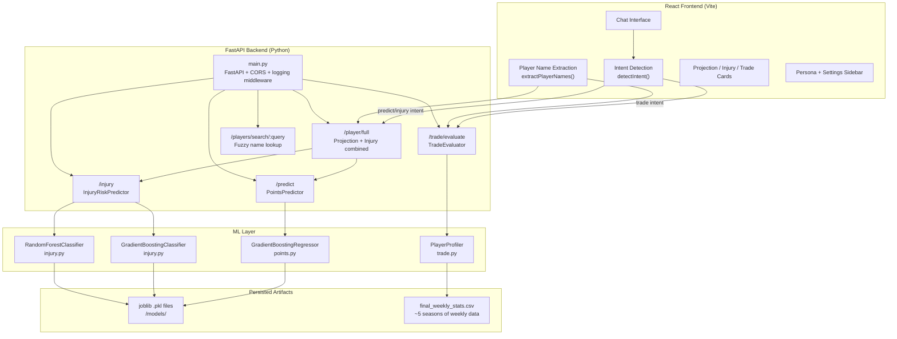
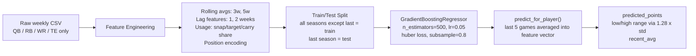
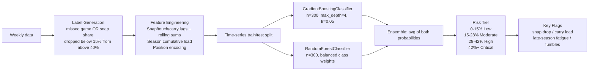
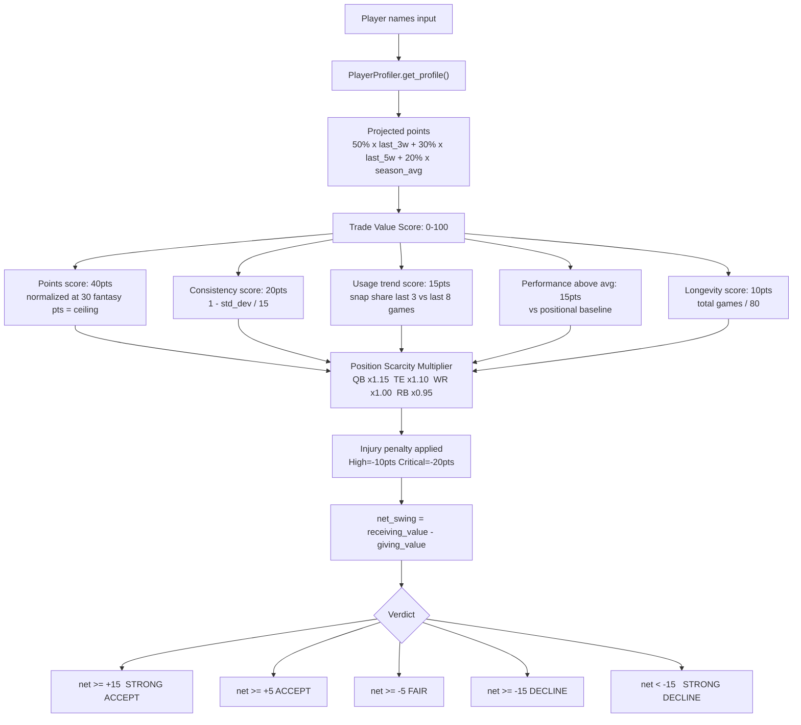

# PlayCaller.ai

An all-in-one fantasy football assistant that combines trained ML models with a GPT-4-powered chat interface. Ask natural language questions, get live ML-backed projections, injury risk scores, and trade evaluations — all in a single conversation.

Built as an independent project for the Advanced Computer Science curriculum at the Massachusetts Academy of Math & Science at WPI.

---

## What It Does

PlayCaller pulls from three separate ML models at query time and injects their output directly into the GPT-4 context window before a response is generated. The user never has to run a separate tool — intent detection figures out what data to fetch automatically.

- **Fantasy Point Projections** — Gradient boosting regressor trained on 5 years of weekly NFL data. Predicts a player's fantasy output with an 80% confidence interval.
- **Injury Risk Scoring** — Ensemble of GradientBoostingClassifier + RandomForestClassifier. Outputs a risk tier (Low / Moderate / High / Critical) with human-readable flags like snap share drops and carry load.
- **Trade Evaluation** — Rule-based value scoring system that profiles each player across projected points, consistency, usage trend, performance above positional average, and longevity — adjusted for position scarcity. Produces a five-tier verdict from STRONG ACCEPT to STRONG DECLINE.
- **GPT-4 Chat** — All three of the above feed into a structured prompt with configurable persona, response focus, depth, and creativity sliders. The model is told to prioritize injected ML data when it's present.

---

## Architecture



---

## How the ML Models Work

### Fantasy Points — `points.py`



The regressor is trained on all seasons except the most recent, which is held out as a test set. At inference time it averages a player's last 5 game rows into a single feature vector and predicts from there. The confidence interval is computed from the standard deviation of recent actual scores, falling back to position-based defaults when data is sparse.

### Injury Risk — `injury.py`



The injury label is derived from whether a player missed the next game or saw their snap share collapse. The ensemble averages both classifiers' probabilities, then applies a fixed threshold table to produce a tier. Flags are computed separately from threshold rules on raw feature values — e.g. `season_carries > 200`, `snap_trend < -0.15`, `touches_avg3 > 22`.

### Trade Evaluation — `trade.py`



`TradeEvaluator` loads both the fantasy and injury models at startup to supplement trade profiles with ML predictions. Warnings are surfaced separately for High/Critical injury players and any player with snap share declining more than 12% over the last 3 vs 8 game window.

---

## Frontend

The entire UI lives in `App.jsx` as a single-file React component. All styling is inline via a `<style>` tag using CSS custom properties — no external stylesheet dependency beyond two Google Fonts (Syne + Geist Mono).

### Intent Detection + ML Injection

Before any message is sent to GPT-4, two things happen client-side:

```js
detectIntent(text)       // → "trade" | "injury" | "predict" | "general"
extractPlayerNames(text) // → regex match on Title Case word pairs
```

If intent is `"trade"`, the message is split on the word "for", player names are extracted from each side, and `evaluateTrade()` fires. Otherwise, `getPlayerFull()` is called on the first detected player name. The ML result is prepended to the GPT-4 prompt as a structured block:

```
--- LIVE ML DATA ---
[ML PROJECTION] Justin Jefferson (WR, MIN): Predicted 18.4 pts (range 10.1–26.7), recent avg 17.2.
[ML INJURY RISK] Low (8%). No major workload concerns detected. Safe to start.
---
User question: Should I start Jefferson this week?
```

### Sidebar Controls

| Control | Options | Effect on GPT Prompt |
|---|---|---|
| Model Persona | Analyst, Coach, Stathead, Skeptic, Insider, Casual | Changes system prompt character and tone |
| Response Focus | Statistics, Narrative, Mixed | Tells GPT what to prioritize in the response |
| Response Depth | 5–100 slider | Maps to "brief and punchy" through "deeply comprehensive" |
| Response Creativity | Fact-Based, Neutral, Creative | Controls factual vs. opinionated output |
| Model API | GPT-4o, GPT-4o-Mini | Selects the OpenAI model used |

### UI Components

- `ProjectionCard` — displays predicted points, 80% confidence interval range, and recent average
- `InjuryCard` — displays risk tier, risk percentage, snap share, season carries, and key flags
- `TradeCard` — displays verdict, giving/receiving player values, net swing, warnings, and natural language summary
- `SourceBadge` — tags each card as `ML Model` or `GPT` depending on data origin

---

## API Reference

All endpoints live in `main.py` (FastAPI, port 8000). CORS is configured for `localhost:3000` and `localhost:5173`. Every endpoint logs request body and response time via middleware.

| Method | Path | Description |
|---|---|---|
| `GET` | `/health` | Returns `{ status: "ok", models: "loaded" }` |
| `POST` | `/predict` | Fantasy point projection for a player |
| `POST` | `/injury` | Injury risk assessment |
| `POST` | `/trade/evaluate` | Full trade breakdown with verdict and warnings |
| `POST` | `/player/full` | Projection + injury in one call |
| `GET` | `/players/search/{query}` | Fuzzy player name autocomplete |

**`POST /predict`**
```json
// Request
{ "player_name": "Justin Jefferson", "season": 2024, "week": 12 }

// Response
{
  "player": "Justin Jefferson",
  "position": "WR",
  "team": "MIN",
  "predicted_points": 18.4,
  "low": 10.1,
  "high": 26.7,
  "range": "10.1–26.7",
  "recent_avg": 17.2,
  "_source": "ml_model"
}
```

**`POST /injury`**
```json
// Response
{
  "player": "Christian McCaffrey",
  "risk_tier": "High",
  "risk_pct": "34%",
  "risk_color": "orange",
  "recommendation": "Check injury report Thursday/Friday. Have a backup ready.",
  "key_flags": [
    "Heavy season carry load (218 carries)",
    "High touch volume (23.4 avg last 3 games)"
  ],
  "recent_avg_snap": 0.91,
  "season_carries": 218,
  "_source": "ml_model"
}
```

**`POST /trade/evaluate`**
```json
// Request
{ "giving": ["Tyreek Hill"], "receiving": ["Justin Jefferson", "Tony Pollard"] }

// Response
{
  "verdict": "STRONG ACCEPT",
  "net_value_swing": 22.3,
  "giving_total": 61.2,
  "receiving_total": 83.5,
  "summary": "Definitely take it. Trading Tyreek Hill for Justin Jefferson + Tony Pollard nets you +22.3 in trade value...",
  "warnings": [],
  "_source": "ml_model"
}
```

---

## Project Structure

```
PlayCaller.ai/
├── backend/
│   ├── main.py                  # FastAPI server, routing, startup model loading
│   ├── points.py                # PointsPredictor — gradient boosting regression
│   ├── injury.py                # InjuryRiskPredictor — GBC + RFC ensemble
│   ├── trade.py                 # TradeEvaluator + PlayerProfiler scoring
│   ├── final_weekly_stats.csv   # ~5 seasons of weekly NFL player stats
│   └── models/                  # joblib-serialized model artifacts (git-ignored)
│
├── frontend/
│   └── src/
│       ├── App.jsx              # Full UI — chat, sidebar, ML cards, GPT integration
│       ├── api.js               # Typed fetch wrappers for all backend endpoints
│       ├── main.jsx             # React entry point
│       ├── Chatbot.jsx          # Standalone chat component (earlier prototype)
│       ├── ChatMessage.jsx      # Message bubble component
│       ├── Navbar.jsx           # Navbar with React Router links
│       ├── App.css
│       └── index.css
│
├── package.json                 # root — react-router-dom v7
└── README.md
```

---

## Setup

### Prerequisites

- Python 3.9+
- Node.js 18+
- OpenAI API key with GPT-4o access

### Backend

```bash
cd backend
pip install fastapi uvicorn scikit-learn pandas numpy joblib

# Train and serialize all three models (first run only — takes a few minutes)
python points.py
python injury.py
python trade.py

# Start the API
python main.py
# Runs on http://localhost:8000
# Swagger docs at http://localhost:8000/docs
```

On subsequent runs `main.py` loads pre-serialized `.pkl` files from `models/` directly — no retraining needed.

### Frontend

```bash
cd frontend
npm install

# Set environment variables
echo "VITE_API_URL=http://localhost:8000" >> .env
echo "VITE_OPENAI_KEY=sk-..." >> .env

npm run dev
# Runs on http://localhost:5173
```

---

## Data

Training data is sourced from the Sleeper API — weekly player stats for QB, RB, WR, and TE across approximately 5 NFL seasons. Features include snap counts, target share, carry share, PPR fantasy points, receiving yards, and derived rolling averages.

The injury label is constructed programmatically: a player is marked as "injured next game" if they missed the following week within the same season, or if their snap share fell below 15% after previously being above 40%.

---

## Notes

- `Chatbot.jsx` and `Navbar.jsx` are from an earlier multi-page version of the app. The current interface is entirely self-contained in `App.jsx`.
- Player name matching is fuzzy across all three models — last-name-only and partial prefix matching are both supported.
- The `_source` field on every API response indicates whether data came from the ML models or was GPT-generated, and is surfaced in the UI via `SourceBadge`.
- All three model classes use module-level singletons so models are loaded once per process and reused across requests.
- Season and week parameters on `/predict` and `/injury` are optional. When omitted, the model uses the most recent available data for that player.

---

## License

MIT — see [LICENSE](LICENSE).

---

*Built at the Massachusetts Academy of Math & Science at WPI.*
